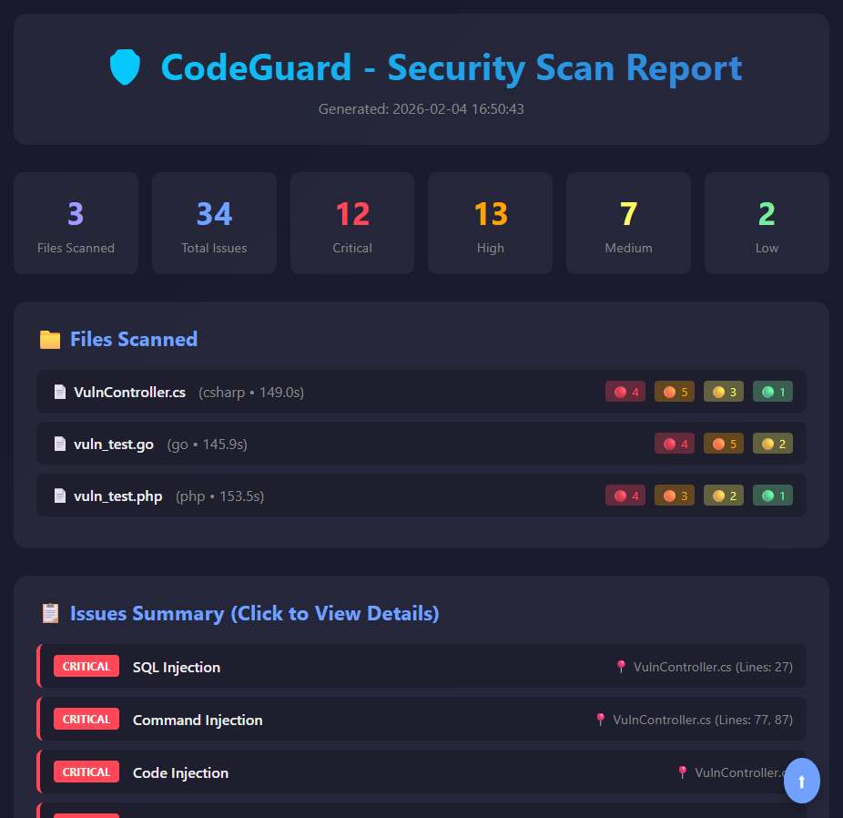

# 🛡️ CodeGuard - AI-Powered Security Code Scanner

<p align="center">
  
  
  
  
</p>

<p align="center">
  <b>Detect security vulnerabilities in your code using local AI - No data leaves your machine!</b>
</p>

## 🎯 Features

- **🔒 100% Private**
  - Runs completely locally using Ollama
  - No code sent to external servers
  - Works offline

- **🔍 16 Vulnerability Types Detected**
  - SQL Injection, Command Injection, Code Injection, Insecure Deserialization
  - XSS, Path Traversal, SSRF, XXE, Hardcoded Secrets, Unrestricted File Upload
  - Weak Cryptography, CSRF, Open Redirect, Missing Authentication
  - Insecure Random Number Generator, Information Disclosure

- **🌐 Language-Aware Scanning**
  - C#, Java, Python, JavaScript/TypeScript, PHP, Go, Ruby, C/C++, Kotlin, Swift, Rust
  - Automatic language detection from code content

- **🖥️ Two Ways to Scan**
  - **CLI Tool**: Scan entire projects, generate beautiful HTML reports
  - **VS Code Integration**: Real-time code review with `/sec` command

- **📊 Beautiful HTML Reports**
  - Clickable issue navigation
  - Severity-based color coding
  - Vulnerable code + Fixed code examples in the correct language
  - Explanations for each vulnerability

---

## 📸 Screenshots

### CLI Scanner

```
════════════════════════════════════════════════════════════
                 PROJECT SCANNER
════════════════════════════════════════════════════════════
  📁 Directory: F:\my-project
────────────────────────────────────────────────────────────
  📊 Files Found:

     • C#.................. 5 files
     • JavaScript.......... 3 files
     • Python.............. 2 files
     ─────────────────────────
     📌 Total:          10 files
════════════════════════════════════════════════════════════

  ✅ [1/10] Completed: UserController.cs      | ⏱️ 49s
  ✅ [2/10] Completed: AuthService.js         | ⏱️ 37s
  ...

  📊 Quick Summary: 15 vulnerabilities found
     🔴 Critical: 3  🟠 High: 5  🟡 Medium: 4  🟢 Low: 3
```

### HTML Report

- Summary cards with vulnerability counts
- Files scanned with per-file statistics
- Clickable issues list
- Detailed findings with:
  - Vulnerable code (from your source)
  - Recommended fix **in the same language**
  - Explanation of why it's vulnerable

### HTML Report - Header & Summary


### VS Code Integration

- Select code → Run `/sec` command
- Instant security analysis
- Vulnerable code + Fixed code suggestions

---

## 🚀 Quick Start

### Prerequisites

1. **Python 3.8+**
2. **Ollama** - [Download here](https://ollama.ai)

### Installation

```bash
# 1. Clone the repository
git clone https://github.com/mzaidii/CodeGuard.git
cd CodeGuard

# 2. Install Python dependencies
pip install -r requirements.txt

# 3. Start Ollama (if not already running)
ollama serve

# 4. Create the security model
cd ollama
ollama create codeguard -f Modelfile
# ⏳ This will download VulnLLM-R-7B (~4.5GB) on first run

# 5. Verify model is created
ollama list
# You should see "codeguard" in the list
```

> **Note:** The base model ([VulnLLM-R-7B-GGUF Q4_K_M](https://huggingface.co/mradermacher/VulnLLM-R-7B-GGUF)) is a security-focused fine-tuned model based on reasoning capabilities. It will be automatically downloaded when you create the codeguard model. This requires ~4.5GB of disk space and may take a few minutes depending on your internet connection.

### Usage

#### CLI Scanner

```bash
# Interactive mode - scan current directory
python cli.py

# Scan specific directory
python cli.py /path/to/project

# Scan single file
python cli.py vulnerable.py

# Quick summary (no detailed analysis)
python cli.py app.py --summary

# JSON output
python cli.py app.py --json
```

#### VS Code Integration

1. Install [Continue Extension](https://marketplace.visualstudio.com/items?itemName=Continue.continue)
2. Copy config to Continue:
   ```bash
   # Windows
   copy vscode-config\config.json %USERPROFILE%\.continue\config.json

   # Linux/Mac
   cp vscode-config/config.json ~/.continue/config.json
   ```
3. **Available Commands:**

   | Command | Description | Use Case |
   |---------|-------------|----------|
   | `/sec` | Full Security Review | Detailed analysis with fixes |
   | `/secfix` | Fix All Vulnerabilities | Get complete fixed code |
   | `/secquick` | Quick Summary | Fast vulnerability list |

4. **How to Use:**
   - Select code you want to review
   - Press `Ctrl+Shift+L` (or `Cmd+Shift+L` on Mac)
   - Type `/sec`, `/secfix`, or `/secquick`
   - Press Enter
   - Get instant security analysis!

---

## 📋 Detected Vulnerabilities

| Severity | Vulnerabilities |
|----------|-----------------|
| 🔴 **CRITICAL** | SQL Injection, Command Injection, Code Injection, Insecure Deserialization |
| 🟠 **HIGH** | XSS, Path Traversal, Hardcoded Secrets, SSRF, XXE, Unrestricted File Upload |
| 🟡 **MEDIUM** | Weak Cryptography, Missing Authentication, CSRF, Open Redirect |
| 🟢 **LOW** | Insecure Random, Information Disclosure |

---

## 🔧 How It Works

CodeGuard uses a **hybrid detection approach**:

1. **LLM Analysis** — Code is sent to a local security-focused LLM (VulnLLM-R-7B) via Ollama, which identifies potential vulnerabilities
2. **Pattern-Based Scanning** — The parser runs regex-based detection patterns against the code as a fallback, catching anything the LLM might miss
3. **Language-Aware Fixes** — Fixes are automatically provided in the correct programming language (Go gets Go fixes, PHP gets PHP fixes, etc.)
4. **Smart Classification** — Cross-language false positives are filtered (e.g., Go `db.Exec()` is correctly classified as SQL Injection, not Code Injection)

---

## ⚙️ Configuration

### Modelfile Parameters

Edit `ollama/Modelfile` to adjust:

```
PARAMETER temperature 0.1      # Lower = more consistent results
PARAMETER num_ctx 3072         # Context window size
PARAMETER num_predict 1200     # Max output tokens
PARAMETER num_thread 16        # CPU threads (set to your core count)
PARAMETER num_gpu 20           # GPU layers (adjust based on VRAM)
```

### GPU Acceleration

GPU is recommended for acceptable scan speed. Adjust `num_gpu` based on your VRAM:

| VRAM | Recommended `num_gpu` | Notes |
|------|----------------------|-------|
| 4GB  | `20` | Some layers spill to shared memory — this is normal |
| 6GB  | `28` | Most layers on GPU |
| 8GB+ | `35` | Full GPU inference |

> **Tip:** If scanning is slow, don't increase `num_gpu` beyond what your VRAM can handle — layers spilling to shared GPU memory is faster than pushing too many layers and causing memory pressure. Monitor your GPU memory usage to find the sweet spot.

After editing the Modelfile, recreate the model:

```bash
ollama rm codeguard
cd ollama
ollama create codeguard -f Modelfile
```

### Performance Tips

- **4GB VRAM (RTX 3050 etc.):** Use `num_gpu 20`, `num_ctx 3072`, `num_predict 1200`. Expect ~170-190s per file
- **8GB+ VRAM:** You can increase `num_ctx 8192` and `num_predict 2048` for more thorough analysis of large files
- Keep `temperature 0.1` for consistent security analysis
- Set `num_thread` to match your CPU core count

---

## 📁 Project Structure

```
CodeGuard/
├── cli.py              # Main CLI scanner & HTML report generator
├── agent.py            # Ollama API integration with language-aware prompts
├── parser.py           # Vulnerability detection, language-aware fixes & parsing
├── requirements.txt    # Python dependencies
├── ollama/
│   └── Modelfile       # Ollama model configuration (VulnLLM-R-7B)
├── vscode-config/
│   └── config.json     # VS Code Continue extension config
├── Vulncode/           # Sample vulnerable files for testing
│   ├── VulnController.cs
│   ├── vuln_test.php
│   └── vuln_test.go
└── screenshots/
    └── html-report.png
```

---

## 🧪 Testing

Test the scanner with included vulnerable files:

```bash
# Scan all test files
python cli.py Vulncode/

# Or scan individual file
python cli.py Vulncode/VulnController.cs

# Scan Go test file
python cli.py Vulncode/vuln_test.go

# Scan PHP test file
python cli.py Vulncode/vuln_test.php
```

Expected results with the test files:
- **~38-39 findings** across 3 files
- **10 Critical**, **15-16 High**, **7-8 Medium**, **5-6 Low**
- Language-correct fixes for all findings

---

## 🤝 Contributing

Contributions are welcome! Please feel free to submit a Pull Request.

1. Fork the repository
2. Create your feature branch (`git checkout -b feature/AmazingFeature`)
3. Commit your changes (`git commit -m 'Add some AmazingFeature'`)
4. Push to the branch (`git push origin feature/AmazingFeature`)
5. Open a Pull Request

---

## 📝 License

This project is licensed under the MIT License - see the [LICENSE](LICENSE.txt) file for details.

---

## 👤 Author

**Muhammad Zaid**

[](https://www.linkedin.com/in/muhammad-zaid-9650647b/)

---

## 🙏 Acknowledgments

- [Ollama](https://ollama.ai) - Local LLM runtime
- [VulnLLM-R-7B](https://huggingface.co/mradermacher/VulnLLM-R-7B-GGUF) - Security-focused LLM for vulnerability detection
- [Continue](https://continue.dev) - VS Code AI extension

---

**⭐ Star this repo if you find it useful! ⭐**
